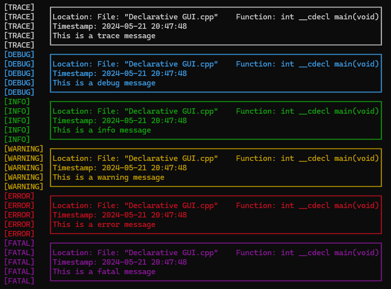

# LogForge

LogForge is a **no-dependencies** logging library for C++.
It is designed to be easy to use and easy to extend.

This library can be used completely without inheritance in order to avoid making calls into virtual lookup tables. On the other hand it is also possible to instantiate instances of the corresponding interfaces such as LogOutput, LogFilter, LogPrinter, Logger etc. The example below shows how to use the library without inheritance.

Note that this library is under development. The API may change in the future.
This library is inspired by the [Dart Logger](https://pub.dev/packages/logger) package.

## Filters

| Modifier		| Description                                   |
| ------------- | --------------------------------------------- |
| Development	| Filters based on the severity	(Debug only)	|
| Production	| Filters based on the severity					|

## Outputs

| Modifier		| Description						|
| ------------- | ---------------------------------	|
| Stream		| Outputs to a stream				|
| Multi			| Outputs to a multiple log outputs	|

## Printers

| Modifier		| Description                                   | Customizable  |
| ------------- | --------------------------------------------- | ------------- |
| Lines			| Print only the message without time etc.		| No			|
| LogFmt		| Print the whole event in logfmt format		| Yes			|
| Timestamped	| Add a timestamp above the message				| Yes			|
| Located		| Add a source location above the message		| Yes			|
| Boxed			| Wrap the message inside a box					| No			|	
| Prefixed		| Adds a prefix based on the Severity			| Yes			|
| Colorized		| Colorizes the message based on the Severity	| Yes			|

## Usage

```cpp

#include <iostream>
#include <LogForge/LogForge.hpp>

int main() {
	using namespace LogForge;

	// The order matters! Try different orders to see the difference
	const auto printer = Message() //< Could also be LogFmt().
		>> Timestamped()    // Add timestamp to the output
		>> Located()        // Add source location to the output
		>> Boxed()          // Surround the output with a box
		>> Prefixed()       // Add a corresponding prefix to the output
		>> Colorized()      // Add color to the output

	const auto logger = LogForge::DefaultLogger(
		DevelopmentFilter(),
		StreamOutput(std::wcout),
		printer
	);

	logger.Trace(L"This is a trace message");
	logger.Debug(L"This is a debug message");
	logger.Info(L"This is a info message");
	logger.Warning(L"This is a warning message");
	logger.Error(L"This is a error message");
	logger.Fatal(L"This is a fatal message");
}
```

Using the library would produce outputs like the following:




## Additional Information

On Windows, you can use the following code to enable ANSI escape codes in the console:

```cpp
#include <Windows.h>

BOOL EnableVirtualTerminalProcessing() {
	HANDLE hOut = GetStdHandle(STD_OUTPUT_HANDLE);
	if (hOut == INVALID_HANDLE_VALUE) {
		return FALSE;
	}

	DWORD dwMode = 0;
	if (not GetConsoleMode(hOut, &dwMode)) {
		return FALSE;
	}

	if (not SetConsoleMode(hOut, dwMode | ENABLE_VIRTUAL_TERMINAL_PROCESSING)) {
		return FALSE;
	}

	return TRUE;
}

/// ...

int main() {
	if (not EnableVirtualTerminalProcessing()) {
		std::cerr << "Failed to enable virtual terminal processing" << std::endl;
		return 1;
	)

	// ...
}
```

[](https://opensource.org/licenses/BSD-3-Clause)